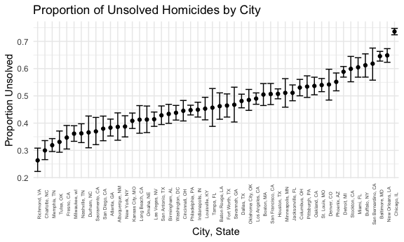

p8105_hw5_zo2168
================
Zhengkun Ou
2024-11-14

## Question 1

``` r
birthday <- function(n){
  birthdays <- sample(1:365, n, replace = TRUE)
  any(duplicated(birthdays))
}

prob <- tibble(n = 2:50) %>%
  mutate(prob = map_dbl(n, ~mean(replicate(10000, birthday(.x)))))
prob
```

    ## # A tibble: 49 × 2
    ##        n   prob
    ##    <int>  <dbl>
    ##  1     2 0.0028
    ##  2     3 0.0087
    ##  3     4 0.0143
    ##  4     5 0.0288
    ##  5     6 0.0411
    ##  6     7 0.0562
    ##  7     8 0.0697
    ##  8     9 0.0977
    ##  9    10 0.118 
    ## 10    11 0.142 
    ## # ℹ 39 more rows

``` r
ggplot(prob, aes(x = n, y = prob)) +
  geom_line() +
  labs(title = "Probability of at least two people sharing a birthday",
       x = "Group size",
       y = "Probability")
```


## Question 2

``` r
set.seed(123)

run_simulation <- function(mu, n = 30, sigma = 5, nsims = 5000) {
  results <- map_dfr(1:nsims, function(i) {
    x <- rnorm(n, mean = mu, sd = sigma)
    
    test_results <- t.test(x, mu = 0) %>% broom::tidy()
    
    list(
      sim = i,
      estimate = test_results$estimate,
      p_value = test_results$p.value
    )
  })
  
  results$true_mu <- mu
  results
}

mu_values <- c(0, 1, 2, 3, 4, 5, 6)
all_results <- map_dfr(mu_values, run_simulation)

summary_stats <- all_results %>%
  group_by(true_mu) %>%
  summarise(
    power = mean(p_value < 0.05),
    avg_estimate = mean(estimate),
    avg_estimate_rejected = mean(estimate[p_value < 0.05])
  )
```

``` r
power_plot <- ggplot(summary_stats, aes(x = true_mu, y = power)) +
  geom_line() +
  geom_point() +
  labs(
    title = "Power Analysis for One-Sample T-Test",
    x = "True Value of μ",
    y = "Power (Proportion of Rejected Null Hypotheses)",
    caption = "Based on 5000 simulations per μ value\nn = 30, σ = 5, α = 0.05"
  )
power_plot
```


``` r
estimates_plot <- ggplot(summary_stats, aes(x = true_mu)) +
  geom_line(aes(y = avg_estimate, color = "All Samples")) +
  geom_line(aes(y = avg_estimate_rejected, color = "Rejected Samples Only")) +
  geom_abline(slope = 1, intercept = 0, linetype = "dashed", alpha = 0.5) +
  labs(
    title = "Average Estimates vs True μ",
    x = "True Value of μ",
    y = "Average Estimate",
    color = "Sample Type",
    caption = "Dashed line represents y = x"
  )
estimates_plot
```


### 1. Small Effect Sizes (μ ≈ 0-2)

- The yellow line (rejected samples) lies **above** the true value line
  (dashed y=x)
- This indicates an upward bias in the estimates when only considering
  significant results
- This phenomenon demonstrates selection bias or “winner’s curse” -
  we’re only seeing results extreme enough to reject the null hypothesis

### 2. Large Effect Sizes (μ \> 4)

- The yellow line converges with:
  - The purple line (all samples)
  - The dashed line (true values)
- This convergence occurs because:
  - Larger effect sizes provide more statistical power
  - More tests reject the null hypothesis
  - Less selection bias as we’re not just selecting extr

## Question 3

``` r
suicide <- read_csv("homicide-data.csv")
```

    ## Rows: 52179 Columns: 12
    ## ── Column specification ────────────────────────────────────────────────────────
    ## Delimiter: ","
    ## chr (9): uid, victim_last, victim_first, victim_race, victim_age, victim_sex...
    ## dbl (3): reported_date, lat, lon
    ## 
    ## ℹ Use `spec()` to retrieve the full column specification for this data.
    ## ℹ Specify the column types or set `show_col_types = FALSE` to quiet this message.

``` r
suicide <- 
  suicide |>
  mutate(
    city_state = str_c(city, state, sep = ", ")
  ) |>
  filter(city_state != "Tulsa, AL") |>
  group_by(city_state) |>
  summarize(
    total_homicides = n(),
    unsolved_homicides = sum(disposition %in% c("Closed without arrest", "Open/No arrest"))
  )

run_prop_test <- function(n_unsolved, n_total) {
  prop.test(n_unsolved, n_total) |>
    broom::tidy() |>
    select(estimate, conf.low, conf.high)
}

baltimore_test <- suicide |>
  filter(city_state == "Baltimore, MD") |>
  summarize(
    result = run_prop_test(unsolved_homicides, total_homicides)
  )


city_proportions <- suicide |>
  mutate(
    test_results = map2(unsolved_homicides, total_homicides, \(x,y) run_prop_test(x, y)
    )
  ) |>
  unnest(test_results)

city_proportions
```

    ## # A tibble: 50 × 6
    ##    city_state     total_homicides unsolved_homicides estimate conf.low conf.high
    ##    <chr>                    <int>              <int>    <dbl>    <dbl>     <dbl>
    ##  1 Albuquerque, …             378                146    0.386    0.337     0.438
    ##  2 Atlanta, GA                973                373    0.383    0.353     0.415
    ##  3 Baltimore, MD             2827               1825    0.646    0.628     0.663
    ##  4 Baton Rouge, …             424                196    0.462    0.414     0.511
    ##  5 Birmingham, AL             800                347    0.434    0.399     0.469
    ##  6 Boston, MA                 614                310    0.505    0.465     0.545
    ##  7 Buffalo, NY                521                319    0.612    0.569     0.654
    ##  8 Charlotte, NC              687                206    0.300    0.266     0.336
    ##  9 Chicago, IL               5535               4073    0.736    0.724     0.747
    ## 10 Cincinnati, OH             694                309    0.445    0.408     0.483
    ## # ℹ 40 more rows

``` r
ggplot(city_proportions, aes(x = fct_reorder(city_state, estimate))) +
  geom_point(aes(y = estimate)) +
  geom_errorbar(aes(ymin = conf.low, ymax = conf.high)) +
  labs(
    title = "Proportion of Unsolved Homicides by City",
    x = "City, State",
    y = "Proportion Unsolved",
  ) +
  theme(axis.text.x = element_text(size = 5, angle = 90))
```


